# Obsidian Citrus

Obsidian theme with citrus colors.

## Color palette

### Lemon

1.	Bright yellow (#FFF44F)
    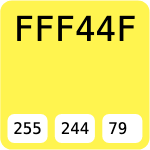

2.	Golden yellow (#F9D71C)
    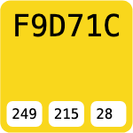

3.	Lime green (#BFD641)
    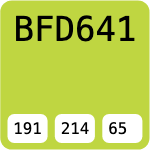

### Lime

1.	Intense lime green (#32CD32)
    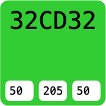

2.	Acid green (#A4C639)
    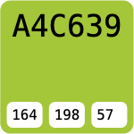

3.	Light green (#D3F0A3)
    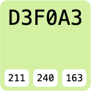

### Kumquat

1.	Deep orange (#FF9933)
    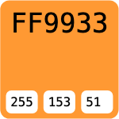

2.	Bright orange (#FFB347)
    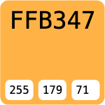

3.	Warm yellow (#FFD966)
    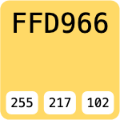

### Blood orange

1.	Intense red (#D94A3A)
    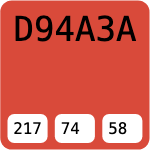

2.	Dark orange (#E87524)
    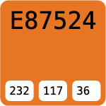

3.	Deep burgundy (#8B1A1A)
    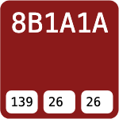